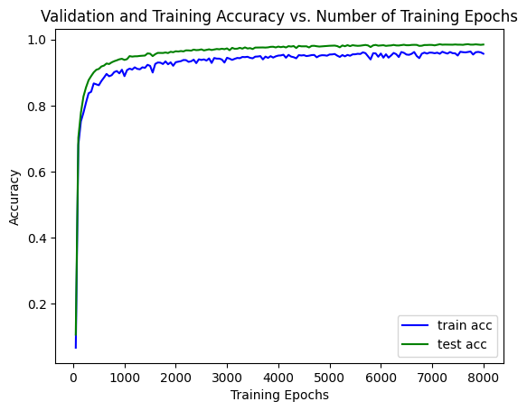
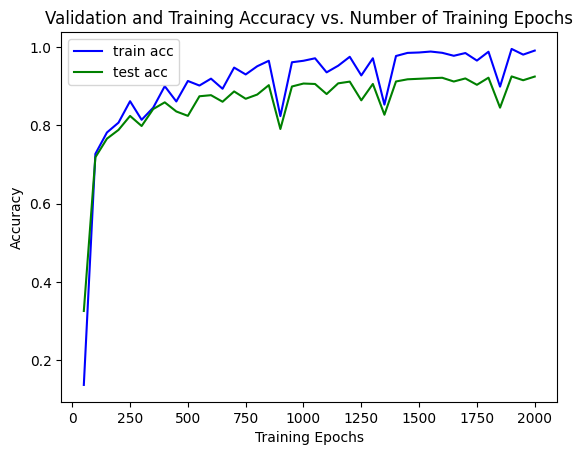
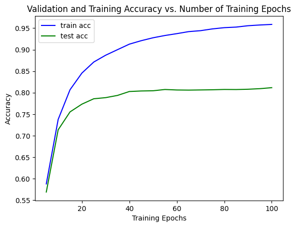

# avila_bible_classifier
### This repo is about writer identification in the Avila data set through page layout features by different classifiers

In this repo, different classification methods are presented to distinguish different scribe hands in the Avila bible.
The classifiers are the same as those used in the report of De Stefano et al. However, the implementation differs by the flow and the parameters. As you can see in the results section, I was able to beat the high score test accuracy of De Stefano et al. My proposed neural network classifies the data with a test accuracy of 98.59%

---

#### Results

Author | Classifier | Test Acc %
-------- | -------- | --------
weiJul   | DT   | 97.02%
De Stefano et al.   | DT  | 98.25%
weiJul   | NN   | **98.59%**
De Stefano et al.   | NN  | 94.56%
weiJul   | k-NN   | 75.78%
De Stefano et al.   | k-NN  | 75.61%
weiJul   | SVM   | 70.30%
De Stefano et al.   | SVM  | 82.67%

DT = decision tree ; NN = neural network ; k-NN = k-nearest-neighbours ; svm = support vector machines 

Here are some plots of different neural networks and hyperparameters

##### Best training history: net_deep.py (optimizer = RSMprop) 

##### Training history of net_bn.py (optimizer = RSMprop)

##### Training history of net_bn.py (optimizer = lbfgs)

---

#### How to run this repo

*Get Data*
* Avila-Bible/code/$ curl -o avila.zip https://archive.ics.uci.edu/ml/machine-learning-databases/00459/avila.zip
* Avila-Bible/code/$ unzip avila.zip

*Run Code*
* This code is written in python you may need numpy, pyTorch, scikit-learn and matplotlib
* preProData.py transforms the data form the .txt to python arr[]
* Each classifier has his own .py {NN: avila-nn.py, k-NN: avila-knn.py, SVM: avila-svm.py, DT: avila-dt.py}
* net_bn.py and net_deep.py are containing the neural nets

---

#### Data set
[C. De Stefano, M. Maniaci, F. Fontanella, and A. Scotto di Freca, Reliable writer identification in medieval manuscripts through page layout features: The 'Avila' Bible case, Engineering Applications of Artificial Intelligence, Volume 72, 2018, pp. 99-110.](https://archive.ics.uci.edu/ml/datasets/Avila)

#### Paper

@article{DESTEFANO201899,
title = {Reliable writer identification in medieval manuscripts through page layout features: The “Avila” Bible case},
journal = {Engineering Applications of Artificial Intelligence},
volume = {72},
pages = {99-110},
year = {2018},
issn = {0952-1976},
doi = {https://doi.org/10.1016/j.engappai.2018.03.023},
url = {https://www.sciencedirect.com/science/article/pii/S0952197618300721},
author = {C. De Stefano and M. Maniaci and F. Fontanella and A. Scotto di Freca},
keywords = {Palaeography, Medieval handwritings, Feature selection, Classification, Reject option, Writer identification},
}

